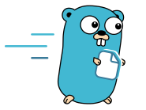

# Filegate

Fast, reliable file gateway with a stable Pebble index and reverse path/id lookup.

Filegate is a Linux-first HTTP service for cloud backends that need filesystem storage with strict boundaries, high metadata throughput, and robust upload semantics.

## Overview

- Stable metadata index in Pebble with explicit index format versioning and rescan tooling
- Reverse lookup cache for fast `path -> id` and `id -> path` operations
- Index-first metadata and directory listings (very low latency on hot paths)
- External filesystem change sync (btrfs `find-new` delta mode or poll mode, eventual consistency)
- Strong upload semantics: one-shot + chunked out-of-order + duplicate-safe + auto-finalize
- Production delivery options: single binary, Docker image, RPM/DEB packages, systemd unit
- Stateless TypeScript client pattern with relay/file utilities for cloud backends

## Quickstart

### 1. Start Filegate

```bash
docker run --rm -d \
  --name filegate \
  -p 8080:8080 \
  -e FILEGATE_AUTH_BEARER_TOKEN=dev-token \
  -e FILEGATE_STORAGE_BASE_PATHS=/data \
  -e FILEGATE_STORAGE_INDEX_PATH=/var/lib/filegate/index \
  -v "$(pwd)/data:/data" \
  ghcr.io/valentinkolb/filegate:latest \
  serve
```

### 2. Install and run TS example

```bash
npm i @valentinkolb/filegate
```

```ts
// hello.ts
import { filegate } from "@valentinkolb/filegate/client";

process.env.FILEGATE_URL = "http://127.0.0.1:8080";
process.env.FILEGATE_TOKEN = "dev-token";

const roots = await filegate.paths.list();
console.log("roots:", roots.items.map((n) => `${n.name} (${n.id})`));
```

```bash
node hello.ts
```

### 3. Browser note

In browsers, do not rely on env-based defaults. Create an explicit client instance:

```ts
import { Filegate } from "@valentinkolb/filegate/client";

const fg = new Filegate({
  baseUrl: "https://filegate.internal.example",
  token: "<short-lived-backend-token>",
});
```

See full TS usage in [docs/ts-client.md](https://github.com/ValentinKolb/filegate/blob/main/docs/ts-client.md).

## Quick Start (Local Binary)

### 1. Build

```bash
go build -o ./bin/filegate ./cmd/filegate
```

### 2. Minimal config

```yaml
# conf.yaml
server:
  listen: ":8080"

auth:
  bearer_token: "dev-token"

storage:
  base_paths:
    - /tmp/filegate-data
  index_path: /tmp/filegate-index
```

### 3. Start

```bash
mkdir -p /tmp/filegate-data /tmp/filegate-index
./bin/filegate serve --config ./conf.yaml
```

### 4. Smoke test

```bash
curl -sS -H 'Authorization: Bearer dev-token' \
  http://127.0.0.1:8080/v1/paths/
```

## Documentation

- Docs index: [docs/README.md](https://github.com/ValentinKolb/filegate/blob/main/docs/README.md)
- CLI reference: [docs/cli.md](https://github.com/ValentinKolb/filegate/blob/main/docs/cli.md)
- HTTP routes: [docs/http-routes.md](https://github.com/ValentinKolb/filegate/blob/main/docs/http-routes.md)
- Architecture + index internals: [docs/architecture.md](https://github.com/ValentinKolb/filegate/blob/main/docs/architecture.md)
- Assumptions and behavior: [docs/behavior-and-assumptions.md](https://github.com/ValentinKolb/filegate/blob/main/docs/behavior-and-assumptions.md)
- TS client in depth: [docs/ts-client.md](https://github.com/ValentinKolb/filegate/blob/main/docs/ts-client.md)
- Benchmarks: [docs/benchmarks.md](https://github.com/ValentinKolb/filegate/blob/main/docs/benchmarks.md)
- Deployment: [docs/deployment.md](https://github.com/ValentinKolb/filegate/blob/main/docs/deployment.md)
- Sysadmin guide: [docs/sysadmin.md](https://github.com/ValentinKolb/filegate/blob/main/docs/sysadmin.md)
- Code patterns: [docs/code-patterns.md](https://github.com/ValentinKolb/filegate/blob/main/docs/code-patterns.md)

## Limitations

Filegate is single-node and assumes that writes happen primarily through
its own API. Use through the API is consistent. Use against a watched
mount that other tools also modify has the constraints below.

### External-mutation behavior on the watched mount

| Operation | Behavior | Notes |
|---|---|---|
| `cp -a src dst` (preserves xattrs) | `dst` is assigned a fresh UUID; `src` keeps its original ID. | xattr-clone is treated as a duplicate; the conflict rule re-issues. |
| `btrfs subvolume snapshot` of a watched subvolume | Snapshot files get fresh UUIDs; originals keep their IDs. | Avoid placing snapshots inside the watched tree if you rely on ID stability across snapshots. |
| `cp --reflink=always` | Both files have independent UUIDs and independent metadata. | OK. |
| Hardlink unlink within the same directory | Cleaned automatically by the directory-sync pass. | OK. |
| Hardlink unlink across directories | Stale child entry in the alias's parent directory persists until the next event in that directory or until `Rescan` is called. | Eventual consistency. |
| Hardlink rename within a subvolume | btrfs `find-new` does not always emit; the new name appears after `Rescan`. | Trigger `Rescan` after such operations. |
| Nested `btrfs subvolume delete` of a child of a watched subvolume | Known issue: the parent's btrfs detector errors until the gateway restarts. | Don't nest subvolumes inside a watched mount, or restart the gateway after the delete. |
| Strip `user.filegate.id` xattr externally | The path is re-indexed with a fresh UUID on the next sync. The previous ID becomes orphan and is purged on the next `Rescan`. | OK. |
| `umount` of a watched mount while the gateway runs | Not tested; expect errors until restart. | Stop the gateway before unmounting. |
| Power loss / disk full during a write | Pebble WAL replays on restart. Disk-full mid-write is not extensively tested. | The atomic upload finalize relies on Linux `rename(2)` and survives crashes; `.part` files are cleaned by the upload manager. |

### Convergence model

Most external-mutation inconsistencies are eventually consistent: the next
detector event for the affected directory triggers a `ReconcileDirectory`
pass that drops stale child entries and indexes new ones. The only
inconsistencies that persist indefinitely without operator action are:

- A `cp -a` duplicate where the operator wants the original to keep its ID
  but the second sync got there first. Detection order is non-deterministic.
- A nested-subvolume-delete bug that requires a gateway restart.

`POST /v1/admin/rescan` (or `svc.Rescan()` from code) reconciles the index
with the on-disk state at any time and is safe to call under load.

### Production gaps (not implemented)

- No Prometheus / OpenTelemetry metrics; logs are unstructured (`log.Printf`).
- Single bearer token, no rotation, no JWT.
- No request rate limiting or per-tenant quotas.
- Single-node only; no replication.
- No audit log of mutations.
- No read-only / maintenance mode.

These are deliberate omissions for the current scope, not regressions.

## Benchmarks and Tests

```bash
make test
make test-race
make fuzz-smoke
make bench-go
make bench-http
make bench-compose
```

## Agent Skills

- TS integration skill: [skills/filegate-ts-client/SKILL.md](https://github.com/ValentinKolb/filegate/blob/main/skills/filegate-ts-client/SKILL.md)
- Repo engineering skill: [skills/filegate-repo-agent/SKILL.md](https://github.com/ValentinKolb/filegate/blob/main/skills/filegate-repo-agent/SKILL.md)

## Contributing (Short)

1. Keep Linux production behavior stable and explicit.
2. Add tests for every behavior change.
3. Run `make test` and `make bench-go` before opening PRs.
4. Update docs in the same change when API/ops behavior changes.

## License

MIT, see [LICENSE](https://github.com/ValentinKolb/filegate/blob/main/LICENSE).
